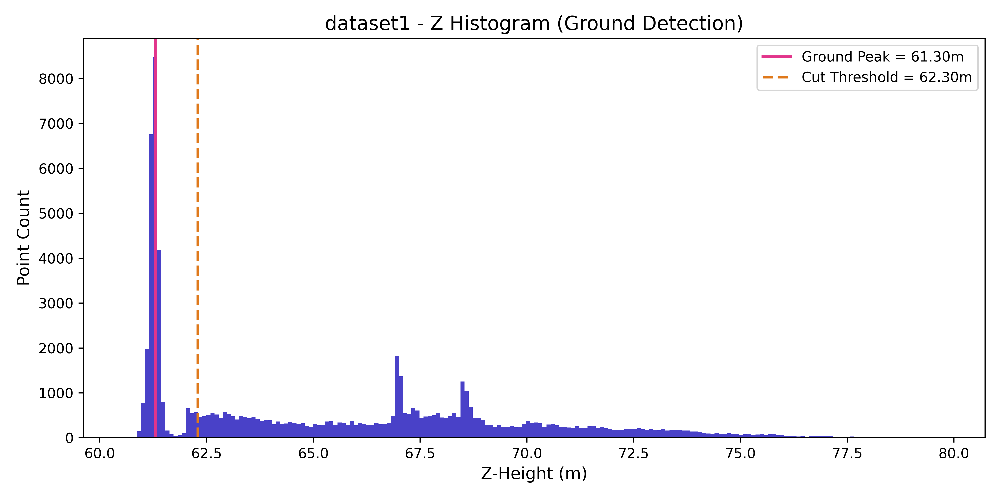
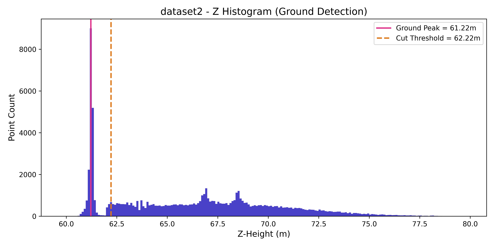
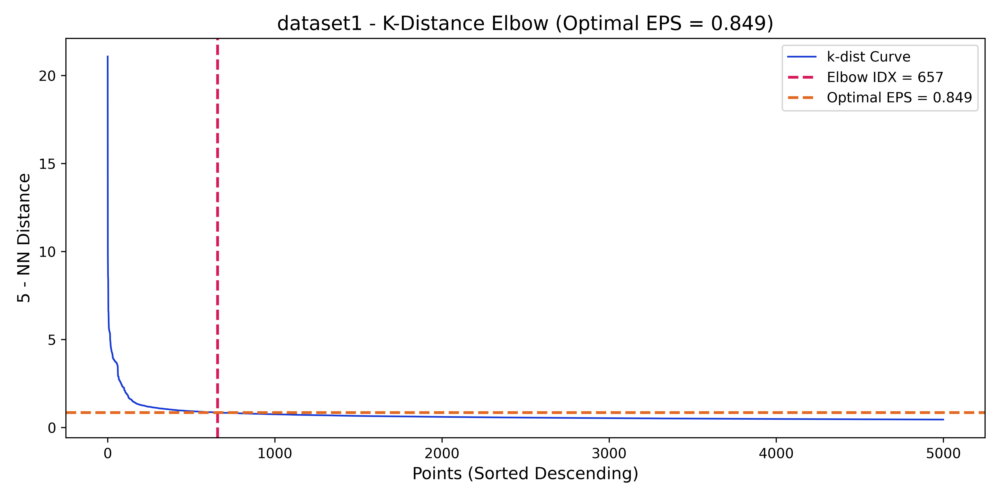
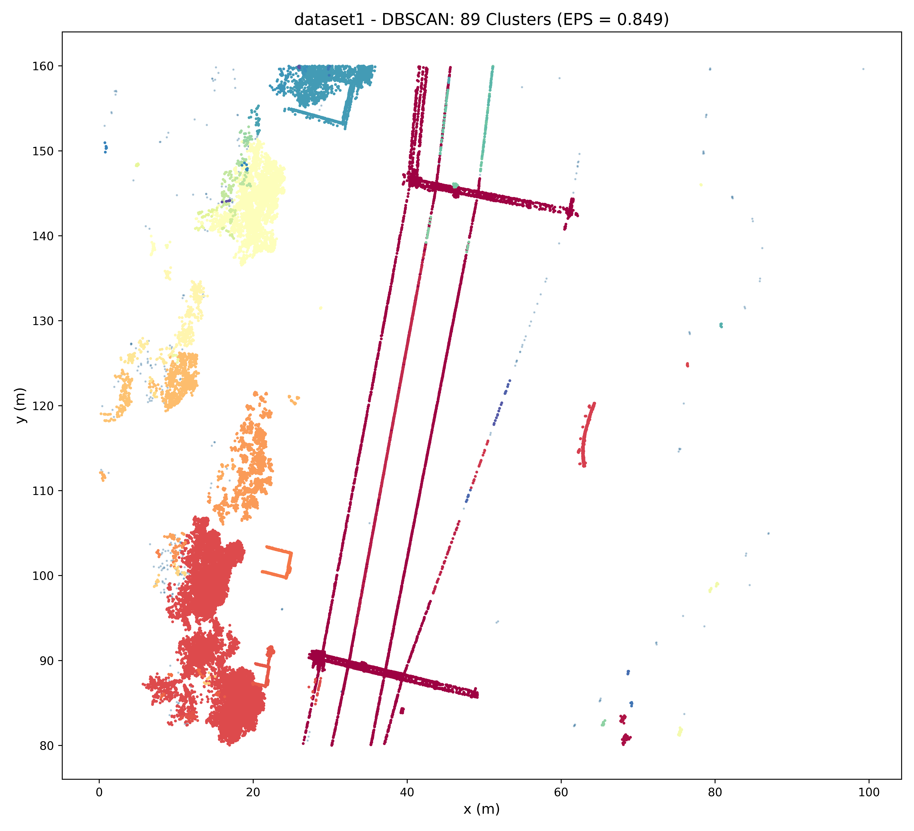
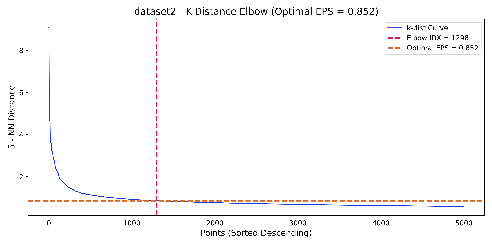
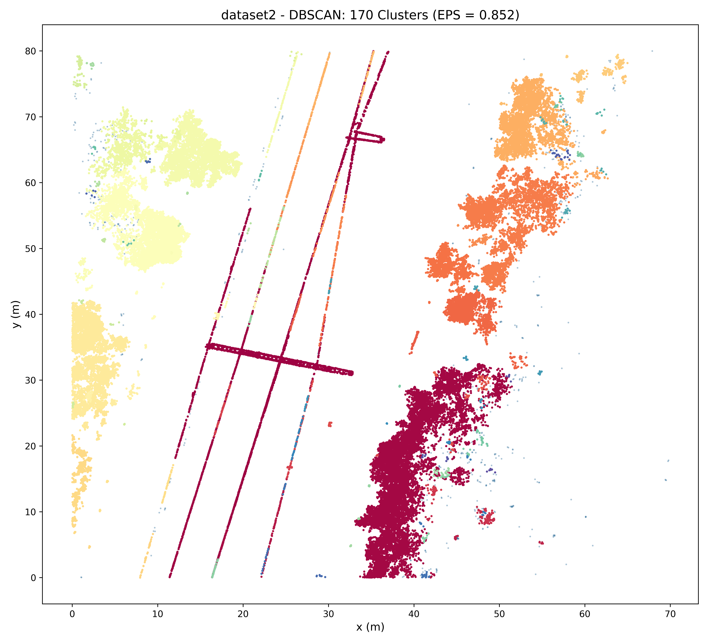
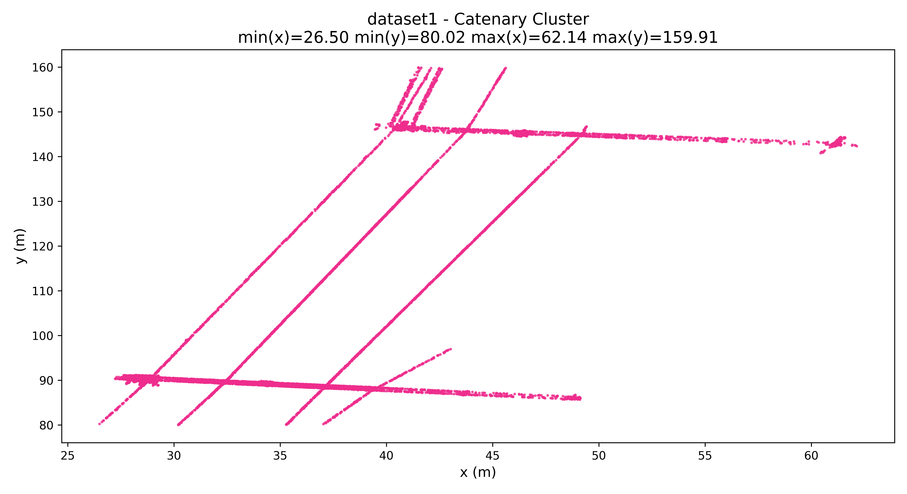
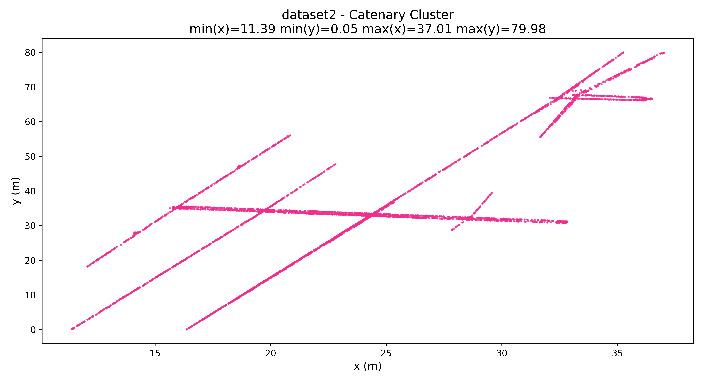

Assignment 5 - LIDAR Point Cloud Analysis

D7015B - Industrial AI and eMaintenance - Part I Theories and Concepts 
Datasets : Aerial LIDAR Scan of a Railway Track Section

Task1 - Ground Level Detection

The ground plane is detected by finding the peak (mode) of the z-histogram. The tallest bar represent the flat terrain which contains the most points. A threshold of **peak + 1m** is applied to remove ground points. 

 dataset1

 | Metric           | Value          |
 |------------------|----------------|
 | Ground Level (m) | 61.298       |
 | Threshold (m)    | 62.298       |

 

 dataset2

 | Metric           | Value          |
 |------------------|----------------|
 | Ground Level (m) | 61.215       |
 | Threshold (m)    | 62.215       |

 

Task2 - Optimal DBSCAN EPS (Elbow Method)

The optimal epsilon is found by computing the 5th nearest-neighbour distance for every point, sorting descending, and locating the maximum-curvature elbow of the resulting curve. That distance value is used as the DBSCAN EPS parameter.

 dataset1

 | Metric           | Value          |
 |------------------|----------------|
 | Optimal EPS      | 0.849        |
 | Clusters found   | 89           |

 
 

 dataset2

 | Metric           | Value          |
 |------------------|----------------|
 | Optimal EPS      | 0.8522       |
 | Clusters found   | 170          |

 
 

Task3 - Catenary Cluster Extraction

The catenary (over power wire) cluster is identified as the cluster with the largest combined XY span (x_range + y_range), since the wire runs along the entire length of the scanned track.

 dataset1

 | Metric | Value          |
 |--------|----------------|
 | min(x) | 26.498       |
 | min(y) | 80.019       |
 | max(x) | 62.14        |
 | max(y) | 159.907      |

 

 dataset2

 | Metric | Value          |
 |--------|----------------|
 | min(x) | 11.393       |
 | min(y) | 0.053        |
 | max(x) | 37.007       |
 | max(y) | 79.976       |

 

Genegirated automatically by 'A5.LidarSolution.py'
